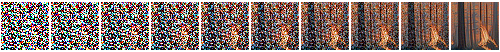
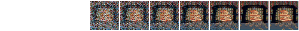

# :material-image-multiple: **IMG2IMG**

This script also provides an `img2img` feature that lets you seed your creations with an initial
drawing or photo. This is a really cool feature that tells stable diffusion to build the prompt on
top of the image you provide, preserving the original's basic shape and layout. To use it, provide
the `--init_img` option as shown here:

```commandline
dream> "waterfall and rainbow" --init_img=./init-images/crude_drawing.png --strength=0.5 -s100 -n4
```

The `--init_img (-I)` option gives the path to the seed picture. `--strength (-f)` controls how much
the original will be modified, ranging from `0.0` (keep the original intact), to `1.0` (ignore the
original completely). The default is `0.75`, and ranges from `0.25-0.75` give interesting results.

You may also pass a `-v<variation_amount>` option to generate `-n<iterations>` count variants on
the original image. This is done by passing the first generated image
back into img2img the requested number of times. It generates
interesting variants.

If the initial image contains transparent regions, then Stable Diffusion will only draw within the
transparent regions, a process called "inpainting". However, for this to work correctly, the color
information underneath the transparent needs to be preserved, not erased.

More details can be found here:
[Creating Transparent Images For Inpainting](./INPAINTING.md#creating-transparent-regions-for-inpainting)

## Technical explanation

The main difference between `img2img` and `prompt2img` is the starting point. While `prompt2img` always starts with pure 
gaussian noise and progressively refines it over the requested number of steps, `img2img` skips some of these earlier steps 
(how many it skips is indirectly controlled by the `--strength` parameter), and uses instead your initial image mixed with gaussian noise as the starting image. 

If the image is being generated in 10 steps using `prompt2img`, the "latent space" (Stable Diffusion's internal representation of the image) develops something like this (the prompt is "fire"):



With `img2img` we get to replace some of the earlier steps with our own image. Because of how Stable Diffusion works, this image needs to be mixed with gaussian noise (fuzz/static). This is where the strength parameter comes in. We can't just insert our image anywhere into the sequence: we have to mix in just the right amount of noise, to match what Stable Diffusion would expect if we were running `prompt2img` without our own initial image. Here is an example with `--strength 0.7`:



And here is one with `--strength 0.4`:


Both of these are using this image as input:


Notice how with strength at 0.7, the first image in the sequence is much more fuzzy/noisy that with strength at 0.4:

| strength | 0.7 | 0.4 |
| -- | -- | -- |
| input to SD |  |  |
| -- | -- | -- | 
| output |  |  |

Both of these look kind of like what I was thinking of. With the strength higher, my input becomes more vague, *and* Stable Diffusion has more steps to refine its output. But it's not really making what I want, which is a picture of cheery open fire. With the strength lower, my input is more clear, *but* Stable Diffusion has less chance to refine itself, so the result ends up inheriting all the problems of my bad drawing.


So the strength parameter  it has to be mixed with the right amount of noise and inserted 

skips some of these earlier steps (how many it skips is indirectly controlled by the `--strength` 
parameter), and uses instead your initial image mixed with gaussian noise as the starting image. If we start with this
drawing of a fireplace:


and then run `img2img` with a strength of 0.7, only 7 steps are performed instead of 10 (because `0.7 * 10 = 7`):
```commandline
dream> "fire" -s10 -W384 -H384 -S1592514025 -I"/tmp/fire-drawing.png" -f 0.7
```


And this is the result:


Here's an example:
```commandline
dream> "fire" -s10 -W384 -H384 -S1592514025
```


Here are the *[latents](https://discuss.huggingface.co/t/decoding-latents-to-rgb-without-upscaling/23204)* (a 
low-resolution representation of the image) after each intermediate step:

When you use `img2img`, some of the initial stages are replaced by your image, which is mixed with some amount of a 
gaussian blur. The `--strength (-f)` parameter controls this process by determining what proportion of the steps are 
skipped. If you're generating with 10 steps and you set the strength to 0.7, `img2img` will only actually perform the 
last 6 steps (`10 * 0.7 = 7`).

### Strength 0.7 (3 steps)
Using this image as `fire-drawing.png`:


and running img2img with 10 steps and a strength of 0.7, 7 steps are performed:
```commandline
dream> "fire" -s10 -W384 -H384 -S1592514025 -I"/tmp/fire-drawing.png" -f 0.7
```


resulting in this image:


### Strength 0.4 (4 steps)
If we turn the strength down to 0.4, only 4 steps are performed:


and this is the result:


